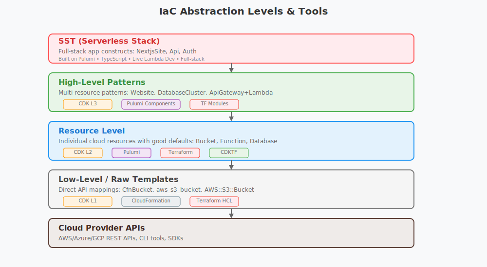

## Init SST Project

```
pnpm init
pnpm dlx sst@latest init
```

## Development

```
pnpm dlx sst dev
```

## Deployment

```
pnpm dlx sst deploy
```

Toggle on auto attach for debugging

https://sst.dev/docs/live/


## IaC Background

Infrastructure as Code (IaC) is the practice of managing and provisioning cloud resources (servers, databases, networks, etc.) through code instead of manual configuration through web consoles or CLI commands. Instead of clicking buttons in a website GUI to create resources, you write code that defines what infrastructure you want, and the IaC tool creates it for you.

### Key Benefits of IaC

* Version Control
  - Complete history of infrastructure changes
  - Ability to rollback to previous versions
  - Code reviews for infrastructure modifications
  - Collaboration and change tracking
* Consistency/Reproducibility/Disaster Recovery
* Automation (CI/CD)
* Self Documenting

### Traditional vs IaC Approach

Traditional:

1. Developer logs into AWS Console
1. Clicks through UI
1. Creates resources
1. Hopes they remember what they did 🤞
1. Can't easily recreate it 🤷❓
1. Rinse and repeat for all future changes


With Infrastructure as Code:

1. Developer writes infrastructure code
1. Commits to Git
1. Automated deployment
1. Repeatable and trackable 🎯
1. Sleeps like a baby 💤🛏️

### Cloud Provider Specific Implementations

* CloudFormation: declarative DSL IaC implementation (AWS specific)
* AWS CDK: programatic IaC implementation (AWS specific). Generates CloudFormation templates

### Cloud Agnostic Implementations

* Terraform: declarative DSL IaC implementation
* CDKTF: programatic IaC implementation. Generates terraform templates
* Pulumi: ground up programatic IaC implementation. Directly calls cloud provider APIs. No DSL or template generation

### SST

* programatic IaC implementation built on Pulumi.
* Full-stack web application focus
* supports primarily AWS, with some support for others



## SST's Niche

* Full-stack web applications
* Serverless first, but also supports traditional infra
* Higher level abstractions for common patterns (Next.js site, API, Auth, Database, etc)
* Live Lambda Dev - fast edit/deploy/test cycle for Lambdas
* Built on Pulumi - multi-cloud capabilities
* TypeScript - popular language for web developers

### Unique Features

* Resource linking
* Secrets management
* Config file (typescript)

### Why SST moved from CDK to Pulumi (v2 -> v3)

https://sst.dev/blog/moving-away-from-cdk/ 

https://www.pulumi.com/blog/aws-cdk-vs-pulumi-why-sst-switched/

A major catalyst was the wide adoption of the *OpenNext* [architecture](https://opennext.js.org/aws/v2/advanced/architecture) which exposed issues in the old approach. In summary: CDK is not true *IaC*.

> "CDK doesn't create the infrastructure you define. It generates a CloudFormation template (JSON) that CloudFormation will use to create your infrastructure."

Key benefits of Pulumi over CDK:

* Enables resource linking in a single step
* Cyclical dependencies are easier to manage
* Better debugging capabilities (CloudFormation was a black box)
* Improved "multi-cloud" story

## SST Demos

* Live Lambda Development
* Next.js Application with OpenNext Architecture (+ PostgreSQL, Auth)
* [Documentation](https://sst.dev/docs/)

